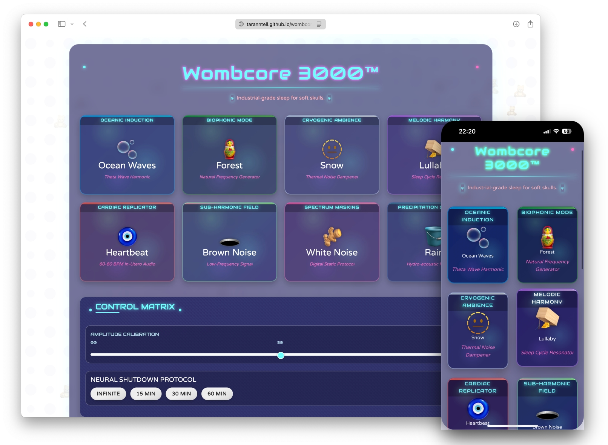

# Wombcore 3000 

**The Industrial-Grade Sleep for Soft Skulls**



A web-based sound machine to help calm, relax, or entertain your baby. Wombcore 3000 generates various soothing sounds using the Web Audio API, with no external sound files needed.

## Features

- **Multiple Sound Types**: Choose from white noise, brown noise, heartbeat, ocean waves, rain, snow, forest ambience, and a gentle lullaby.
- **Sleep Timer**: Automatically stop sounds after 15, 30, or 60 minutes.
- **Volume Control**: Easily adjust the volume to find the perfect level.
- **Background Audio Support**: Lock your mobile device and keep listening.
- **Responsive Design**: Works on mobile devices, tablets, and desktops.
- **No Audio Files**: All sounds are procedurally generated using the Web Audio API.

## Getting Started

### Live Demo

Visit the live version on GitHub Pages: [Wombcore 3000](https://taranntell.github.io/wombcore3000/)

### Local Installation

To run Wombcore 3000 locally:

1. Clone this repository:
   ```bash
   git clone https://github.com/taranntell/wombcore3000.git
   cd wombcore3000
   ```

2. Open `index.html` in your browser.

That's it! No build process or dependencies required.

## How to Use

1. **Play a Sound**: Click on any sound tile to start playing that sound.
2. **Adjust Volume**: Use the volume slider in the controls section.
3. **Set a Timer**: Choose a timer duration if you want the sounds to stop automatically.

## Technical Details

- Built with vanilla HTML, CSS, and JavaScript (ES6+)
- Uses the Web Audio API for real-time procedural sound generation
- Responsive design with Bootstrap 5
- No external dependencies or audio files

## Browser Compatibility

Works on all modern browsers that support the Web Audio API:
- Chrome (recommended)
- Firefox
- Edge
- Safari - Playing sounds in background is not working since JS is getting stopped once mobile device is locked

## Version History

### v0.1.0 – [2023-05-17]
- Initial version of the app
- Added sounds 
- Integrated Web Audio API with volume control
- Responsive mobile layout with Bootstrap
- Basic timer functionality (15/30/60 min)
- Version shown in footer

### v0.2.0 – [2023-05-20]
- Enhanced layout for better display of multiple sound options
- Improved combo mode options to include all available sounds
- Fixed UI issues with play/pause button states

## License

MIT

## Credits

Drop the bass... and the baby (into REM sleep).